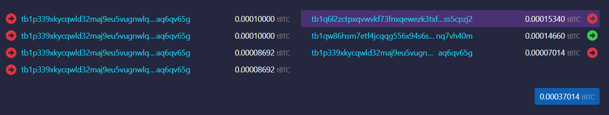
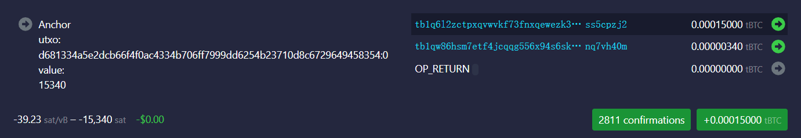
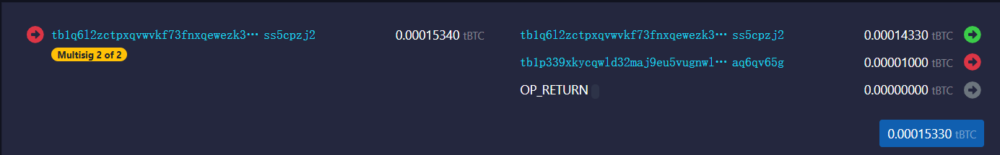
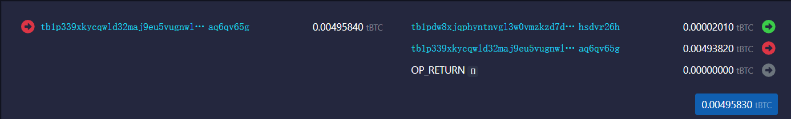
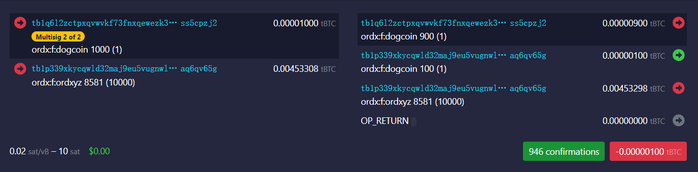
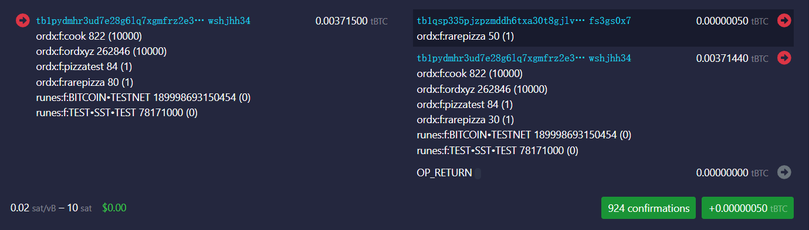
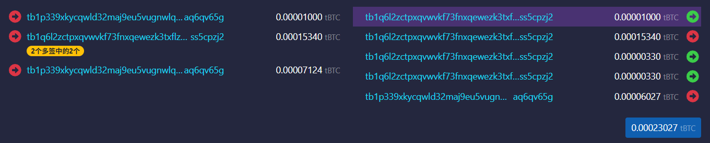
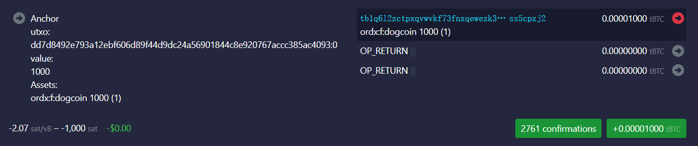
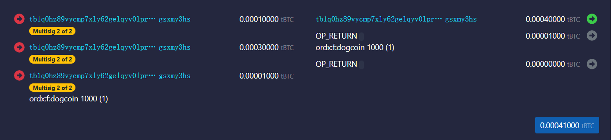
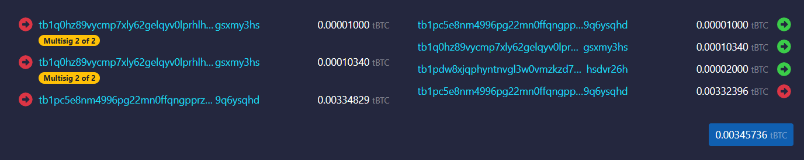

聪穿越协议
====

SAT20的STP协议是一种在BTC主网和聪网之间进行资产穿越的协议，其特点：
1. 基于闪电网络通道RSMC协议，用户拥有资产的最终控制权，该控制权由BTC主网保护
2. 通道由用户钱包公钥和提供接入服务的核心节点公钥共同生成，必须双方签名才能操作
3. 通道的操作由用户主动发起，提供接入的核心节点在STP协议的控制下，自动应答
4. 任何人都可以打开关闭通道，不需要许可

以上特点，决定了STP协议是一种完全去中心化的资产跨越桥，不依赖任何中心化的节点，在整个过程中，用户拥有绝对的控制权。STP协议是一种“无桥之桥”，我们给这种桥起了一个符合BTC精神的名称：比特桥（BitBridge）

STP协议提供以下六个原子操作。

打开通道
----
以SAT20钱包为例，SAT20钱包的接入节点和公钥是：  
主网：022ab2945f61304f117f55d469c341d606ceb729de436c80c0e6ad7819cdd53ce7  
测试网：0367f26af23dc40fdad06752c38264fe621b7bbafb1d41ab436b87ded192f1336e  

每一个钱包地址都会对应一个公钥，该公钥和核心节点先生成一个多签脚本，然后根据该多签脚本生成闪电通道地址，多签脚本如下：
func GenMultiSigScript(aPub, bPub []byte) ([]byte, error) {  
    if bytes.Compare(aPub, bPub) == 1 {  
        aPub, bPub = bPub, aPub  
    }  
    bldr := txscript.NewScriptBuilder(txscript.WithScriptAllocSize(  
        MultiSigSize,  
    ))  
    bldr.AddOp(txscript.OP_2)  
    bldr.AddData(aPub) // Add both pubkeys (sorted)  
    bldr.AddData(bPub)  
    bldr.AddOp(txscript.OP_2)  
    bldr.AddOp(txscript.OP_CHECKMULTISIG)  
    return bldr.Script()  
}  

比如
测试网上的一个钱包公钥：02148cbe135aea8ee9b72f18ca6ddf0efc052e54b6d723cc473a0cc6011766d776  
其地址是：tb1p339xkycqwld32maj9eu5vugnwlqxxfef3dx8umse5m42szx3n6aq6qv65g  
其通道地址是：tb1q6l2zctpxqvwvkf73fnxqewezk3txflzw3se9h82ux9arksekcrss5cpzj2  

从上面的代码中可以看到，任何通道的操作，都是必须双方共同签名，才能解锁通道中的UTXO。

用户需要先切换SAT20钱包为高级模式，然后才能打开自己的通道。打开通道，会构造类似这样的一个交易：  

https://mempool.space/testnet4/tx/d681334a5e2dcb66f4f0ac4334b706ff7999dd6254b23710d8c6729649458354

左边的输入是用户自己的钱包地址（tb1p339xkycqwld32maj9eu5vugnwlqxxfef3dx8umse5m42szx3n6aq6qv65g）中的UTXO
右边的输出：
1. 第一个输出到通道地址（tb1q6l2zctpxqvwvkf73fnxqewezk3txflzw3se9h82ux9arksekcrss5cpzj2），这部分的资产会自动Ascending到聪网 （UTXO：d681334a5e2dcb66f4f0ac4334b706ff7999dd6254b23710d8c6729649458354:0）
2. 第二个输出的打开通道的服务费，输出地址是核心节点和引导节点的通道地址，这是一个公共通道（tb1qw86hsm7etf4jcqqg556x94s6ska9z0239ahl0tslsuvr5t5kd0nq7vh40m）
3. 第三个输出是找零

该交易在主网确认后，聪网会生成一个对应的Ascending TX：  

https://mempool.sat20.org/testnet/tx/b2440213185763316a1ac4c36589053286f1903ba764256e8b4f1f8a6326fe84

可以看到，聪网上的这个交易，标记了其主网输入的UTXO（d681334a5e2dcb66f4f0ac4334b706ff7999dd6254b23710d8c6729649458354:0）和对应的资产类型和数量（Satoshi，15340）。其中的大部分（15000聪）依然停留在通道地址（tb1q6l2zctpxqvwvkf73fnxqewezk3txflzw3se9h82ux9arksekcrss5cpzj2）中，而小部分作为应对通道后续的操作转移到共同通道地址上。在闪电通道的账本中，停留在通道地址的15000聪完全属于用户。  

解锁资产
----
资产在通道中时，虽然其安全级别最高，由BTC主网提供安全保障，但因为每次操作都需要服务节点的配合，涉及多签操作和闪电通道账本的更新等等问题，特别是在涉及多方操作之后，其复杂度会上升到一个无法处理的高度。为了简化操作，用户需要将资产从通道地址解锁到个人的钱包地址上。
解锁操作是一个聪网上的交易，将一部分资产从通道地址转移到个人地址上，同时更新承诺交易。  

https://mempool.sat20.org/testnet/tx/e4183b216442e8009f4393c85e7e8f96f18874d25f668daca499a1501d4cfcd6

上面所展示的交易中，通道地址中的1000聪，解锁到个人的地址上。

这样，个人就可以在聪网上自主签名控制这些资产了。比如  

https://mempool.sat20.org/testnet/tx/c1368ef641d428b9366ff448ce326e289ca4e6b3c7280f74e653247aa535c235

解锁其他资产也类似，比如下面这个交易，将通道中的100个dogcoin解锁到个人地址上。  

https://mempool.sat20.org/testnet/tx/98e23b9d90c1f7a7074f9967e77b41fdddbbeb4299d5d700a777e8a28dc29069

锁定资产
---
在聪网上个人地址上的资产，虽然受到整个聪网的保护，但对于追求极致的安全的用户来说，聪网的安全性毕竟无法跟BTC主网完全一样，这个时候，用户可以通过将资产锁定回闪电通道，从而获得BTC主网的保护。

如果通道有足够的容量，锁定操作就仅仅是聪网上的一个交易，成本低，速度快，但是效果是惊人的，因为这么一个简单的操作，就让用户在聪网上的资产，受到了主网的保护。这种锁定操作，是上面解锁操作的逆过程：  

https://mempool.sat20.org/testnet/tx/b3d11311ff5c30c668802da14bf3ee626c39c6113d4a75f3a60e4414687fff18
上面的交易，50个rarepizza被用户从个人地址tb1pydmhr3ud7e28g6lq7xgmfrz2e3uzxvw0zatv0d8auhwnatzrqawshjhh34重新锁定到通道地址tb1qsp335pjzpzmddh6txa30t8gjlv8kurephdtnwz42f7yxd7afrrfs3gs0x7

如果通道没有足够的容量，锁定操作就需要一组复杂的动作组成，成本很高，这在闪电网络中，类似潜水艇操作：
1. 通过与共同通道的穿越合约交互，在聪网上将要锁定回自己通道的资产（加上潜水艇交易的手续费），转入共同通道，这是一个聪网上的交易
2. 共同通道收到该笔资金时，在主网上发起一笔交易，将用户需要锁定回通道的资产，转入用户自己的通道地址
3. 用户的通道地址接受到这一笔转账后，自动将该笔资金通过一个Ascending TX提升到聪网，同时更新闪电通道的账本
通过上面这个复杂的操作，用户得以将资产锁定回通道，享受BTC主网级别的安全，但是需要支付比较高的费用。（注意这个过程目前还没有实现）

Splicing-In
----
用户随时可以通过Splicing-In操作将更多的资产提升到聪网。这也是将自己的通道扩容的成本最小的方案。

Splicing-In操作需要两个交易：
1. Splicing-In TX:主网上，用户将资产转入通道地址  

https://mempool.space/testnet4/tx/dd7d8492e793a12ebf606d89f44d9dc24a56901844c8e920767accc385ac4093
在这个交易中，用户在第一个输入中提供某种资产（需要主网的索引器才能知道该输入中包含什么样的资产），然后输出到通道地址中。

2. Ascending TX: 该交易确认后，聪网会生成一个对应的Ascending TX  

https://mempool.sat20.org/testnet/tx/b3ba6aae707b5f3c58b34a8b7555c7886a704d55d9447ebd385cbdca0442d62d
从该交易的输入可以很清楚的看到，该输入包含的资产类型和数量。该交易确认后，通道的容量增加了，并且增加的资产都属于用户，用户可以通过Unlock操作，将资产解锁到个人钱包地址。

Splicing-Out
---
用户也随时可以通过Splicing-Out操作，将通道中的资产提取到主网的个人地址上，这相当于减少了通道的容量。

Splicing-Out是Splicing-In的逆操作，也需要两步完成：
1. Descending Tx: 在聪网上将通道中要做Splicing-Out的资产，转入OP_RETURN，转入OP_RETURN的资产，相当于在聪网上销毁。  

https://mempool.sat20.org/testnet/tx/97859eb815367b97f1c9feb1bafdf962483ed9e70397cd07f447fb09dec45e1b
例子中的tb1q0hz89vycmp7xly62gelqyv0lprhlhw4jllzntptmk7qxftxkpwgsxmy3hs是另外一个通道地址，该地址要将1000个dogcoin从通道中提取到主网上的个人地址上
2. Splicing-Out TX: 交易确认后，协议在主网上广播一个交易，将通道中已经在聪网上销毁的资产转入个人地址，同时支付了2000聪的服务费用给服务节点  

https://mempool.space/testnet4/tx/8b4b3e38ebe8fe6a156b0ff1db5fac0daf0506f0fb1ead6edb999d81caa22741

关闭通道
---
因为有splicing操作的存在，关闭通道变成一个很少见的动作，除非用户想永久离开聪网，否则不需要关闭通道。
关闭通道有两种方式，协商关闭和强制关闭。
1. 协商关闭：双方根据最新状态，分割通道中的所有资产，并直接输出到各自的地址上。这是对双方都有利的方案，不需要等待就能取回资产。
2. 强制关闭：一方无法响应的情况下，另一方可以通过广播最新的承诺交易，取回属于自己的资产。但因为闪电网络的机制，这个过程需要等待CSV超时，才能将资金清扫（sweep）回自己的地址。目前CSV设定为1000个区块，大概一周时间。这是为了防止某一方广播了过时的承诺交易，另一方有足够的时间验证并承诺对方。

