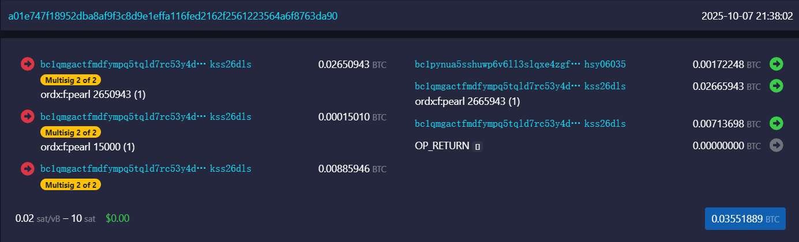

增强的UTXO模型
====

在一层网络，UTXO仅有聪的数量，并没有包含其他数据。当聪穿越到二层网络后，其属性会在UTXO中完全体现，这极大提升了UTXO的能力。  
enUTXO中将包含聪的数量和资产信息，这极大方便聪的流转和聪上资产的验证，除了杜绝双花之外，也让聪网支持任意一种资产提供可能性，还能很直观的了解一个资产的流转历史。这在区块浏览器上可以得到最直观的了解：

https://mempool.sat20.org/tx/a01e747f18952dba8af9f3c8d9e1effa116fed2162f2561223564a6f8763da90

enUTXO甚至可以提供解锁该UTXO的额外信息，这是一个实现不同条件解锁的非常有力的工具，这方面的探索有待展开。
